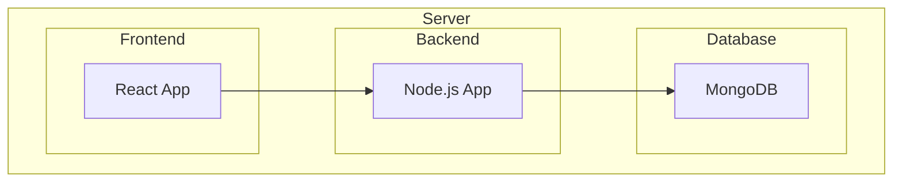

# Municipal Issue Registration App Architecture

## Overview

The Municipal Issue Registration App allows users to submit issues for their municipalities. The app consists of a frontend, backend, and database.

## Architecture

### Frontend

The frontend is built using React and provides a user interface for users to submit issues, display a list of submitted issues, and search and filter issues.

### Backend

The backend is built using Node.js with the Express framework and handles incoming requests from the frontend, processes the data, and stores it in a MongoDB database. The backend also serves the data to the frontend and handles any authentication and authorization logic.

### Database

The database is MongoDB and stores the issue data.

### Deployment

The different components of the system are deployed on a server. The frontend component is a React app, the backend component is a Node.js app, and the database is MongoDB. The frontend communicates with the backend, which in turn communicates with the database.

Here's a diagram that shows how the different components are deployed on a server:

